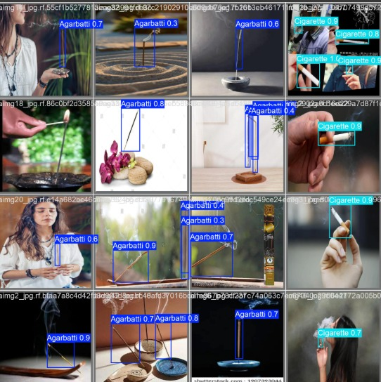
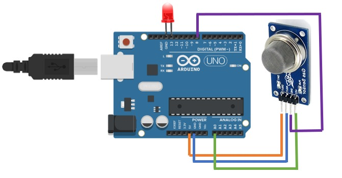
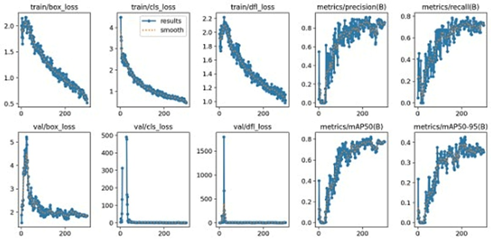

# CO Source Identification using Computer Vision

## Overview
This project identifies sources of Carbon Monoxide (CO) emissions, specifically from cigarettes and incense sticks, using an MQ-7 sensor and a trained object detection model.



## Workflow
1. **CO Detection:** The MQ-7 sensor measures CO levels.
2. **Threshold Check:** If CO levels exceed the safe limit, the system activates object detection.
3. **Object Detection:** A trained model identifies the source of CO emission.
4. **Alerts:** The system logs the detected source and triggers necessary actions.

## Model Performance

| Class       | Images | Instances | Precision | Recall | mAP@50 | mAP@50-95 |
|------------|--------|-----------|------------|-------|---------|------------|
| **All**    | 21     | 25        | 0.916      | 0.721 | 0.778   | 0.428      |
| **Agarbatti** | 12     | 14        | 0.954      | 0.786 | 0.882   | 0.488      |
| **Cigarette** | 9      | 11        | 0.878      | 0.656 | 0.675   | 0.367      |

## Setup

### Hardware Requirements
- **MQ-7 Sensor** - For CO level detection
- **Raspberry Pi / Arduino** - To process sensor data
- **Camera Module** - To capture images for object detection

### Software Requirements
- **Python**
- **OpenCV**
- **YOLOv5** for object detection
- **Flask / FastAPI** (optional, for backend processing)

## Installation

```bash
# Clone the repository
git clone https://github.com/shraddha1558/CO-Source-Identification-using-Computer-vision.git
cd CO-Source-Identification-using-Computer-vision

# Install dependencies
pip install -r requirements.txt

# Run the model
python detect.py --source 0 --weights best.pt --conf 0.5
```

## System Architecture



## Results

The trained model can detect sources of CO emissions in real-time:



## Contributors
- **Shraddha Sahu**

## License
This project is licensed under the MIT License.
